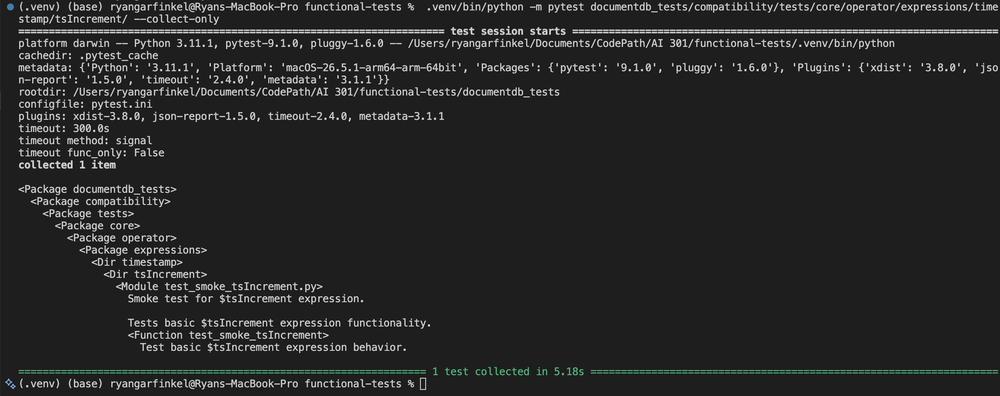
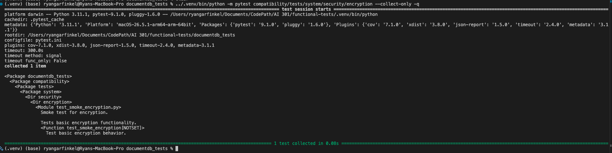

Issue 1: $tsIncrement Operator Notes (last changed: 07/26, status: still awaiting code review)

    
# Contribution 1: Add compatibility test for $tsIncrement (second pass)

**Contribution Number:** 1  
**Student:** Ryan Garfinkel  
**Issue:** [https://github.com/documentdb/functional-tests/issues/210](https://github.com/documentdb/functional-tests/issues/210)  
**Status:** Phase IV Complete

---

## Why I Chose This Issue

I chose this issue because it aligns with my intrest in ensuring some reliability with components in code. This helps ground sytsem behavior and can indicate any regression as new bug fixes or features are added. While the $tsIncrement operator seems simple, writing test cases will push me to think about edge cases and what it means to use this operator. I'm hoping to get a better understanding of test driven development working with new testing frameworks and mocking data to simulate parts of runtime.

---

## Understanding the Issue

### Problem Description

There is currently only one test that covers the $tsIncrement operator, which tests for basic functionality. There are no tests for edge cases, missing values, null values, or type mismatch cases.

### Expected Behavior

There should be more tests for the $tsIncrement operator that extensively cover its behavior and its handeling of edge cases, type errors, and null values. These tests should be added to catch any regressions of the operator as future changes are made.

### Current Behavior

At the moment, the one smoke test runs that checks basic funcationality passes.

### Affected Components

The only affected operator is the $tsIncrement operator. Resolving this issue will invole adding more tests to in the documentdb_tests/compatibility/tests/core/operator/expressions/timestamp/tsIncrement directory. 

---

## Reproduction Process

### Environment Setup

I initally needed to setup an environment to install all required packages. I created the environment using python venv using python 3.11.1.

### Steps to Reproduce

1. Create virtual environment with `python3 -m venv .venv`
2. Activate environment with `source .venv/bin/activate` (different command on windows)
3. Install python requirements with `pip install -r requirements.txt`
4. Run existing $tsIncrement operator tests with `python -m pytest documentdb_tests/compatibility/tests/core/operator/expressions/timestamp/tsIncrement/ --collect-only`

### Reproduction Evidence

- **Commit showing reproduction:** [Link to the branch on my fork](https://github.com/RyanGarfinkel/functional-tests/tree/add-tsIncrement-compatibility-tests)
- **Screenshots/logs:** 
- **My findings:** I found that there was only one smoke test covering the $tsIncrement operator that tests basic functionality.

---

## Solution Approach

### Analysis

The exitsting repository doesn't do a full evaluation of the tsIncrement operator. There is only one smoke test, which does pass. There isn't an known issue with its functionality, but it needs more tests to pick up possible regressions as changes are made in the future.

### Proposed Solution

I need to add more test coverage to the tsIncrement operator to check how the tsIncrement operator handles missing values, null values, and type mismatches. I also need to make sure that I use the existing fixture to avoid rewriting the same object each test. I may also need to add a new error code because I'll be testing with MongoDB.

### Implementation Plan

Using UMPIRE framework (adapted):

**Understand:** The $tsIncrement operator currently has one test that covers basic funcationity with only one timestamp. It needs additional tests to cover more complex functionality and possible errors like missing vales or invalid data types.

**Match:** There are similar expression related tests that are similar to the $tsIncrement operator, and other tests check for null/missing values and invalid data types.

**Plan:** [Step-by-step implementation plan]
1. Create a tsIncrement base class in the utils folder.
2. Create tests for null values.
3. Create tests for invalud data types.
4. Add additional tests in expressions that utilize the tsIncrement operator.

**Implement:** [Link to the branch on my fork](https://github.com/RyanGarfinkel/functional-tests/tree/add-tsIncrement-compatibility-tests)

**Review:** 
- [ ] All tests have docstrings to convey their purpose.
- [ ] Any constants are imported from test_constants.py.
- [ ] Each test makes only one assertion.
- [ ] Any shared dataclasses live in `utils/` directory.
- [ ] Any new filenames follow the test_tsIncrement_{feature}.py name style.

**Evaluate:** In addition to there being a complete suite of tests that pass, the additional compatability tests can run on a live MongoDB database.

---

## Testing Strategy

### Unit Tests

- [x] Test case 1: Checks for null values, missing values, and invalid types (values)
- [x] Test case 2: Nested field access (nested value)

### Integration Tests

- [x] Integration scenario 1: Compatability with $match expression.
- [x] Integration scenario 2: Compatability with $group expression.

### Manual Testing

When setting up my environment with MonogDb through Docker, I had to manually test if the connection was live.

---

## Implementation Notes

### Week 1 Progress

This week, I added tests that involded null types, missing fields, and type mismatch errors. I added 21 test cases and they all passed while running MongoDB (through seperate docker container) in the background. I also had to add a specific, tsincrement error code in the framework list (shared between tests). Additionally, I added a compatbility test to ensure the tsIncrement operator works within match/filter, expression, and group operations.

### Code Changes

- **Files modified:** test_tsIncrement.py, error_codes.py, test_match_with_expr.py, test_group_expr_operators.py
- **Key commits:** [2nd pass & error code](https://github.com/RyanGarfinkel/functional-tests/commit/f22989d21df7a111b73a54ebf092bcb168527bd3), [Wiring test with $match](https://github.com/RyanGarfinkel/functional-tests/commit/aa3f02c0077ac643724ef0cf48283e9f5a5ee699), [Group compatability tests](https://github.com/RyanGarfinkel/functional-tests/commit/6b76a59e32ca83035b36a219f6b09383e41bfee8)
- **Approach decisions:** I target individual (unit) tests on just the tsIncrement operator, but also needed to test how it worked when used with other operators.

### Week 1 Progress

This week, I created the PR to merge my working branch into the main repository's branch. This was more difficult becuase I realized I forgot to add a signoff on my previous 3 commits. I had to rebase my branch and add the signoff. I then had to update my branch with new changes from main, but I was able to fix it. I am now awaiting feedback from a codeowner or maintainer. In the meantime, I will start looking for new issues I can tackle but regulary check in.

### Week 2 Progress

I returned to the issue and noticed there was feedback from a Copilot review that suggested I add an aggregate flag to the pytest file. I added the marker, then committed the change. I also went through the sections for this readme for issue 1 and updated it to refelct the testing changes I made, explain the issue more, and what I learned.

---

## Pull Request

**PR Link:** [functional-tests/pull/654](https://github.com/documentdb/functional-tests/pull/654)

**PR Description:** This PR required me to add additional test coverage to the $tsIncrement operator. Initially, this operator only had one smoke test, which tested basic functionality, not including null/missing input and invalid types. A new error code was added for testing with MongoDB.

**Maintainer Feedback:**
- 07/26/2026: Copilot review mentioned the $match test file should be marked as aggregate when testing its compatability with the tsIncrement operator. I addressed this by adding the marker at the top of the file. [Link to commit](https://github.com/documentdb/functional-tests/pull/654/changes/43afcbeb9dc7edb3b660601225809507a3cf8a19)

**Status:** Awaiting review

---

## Learnings & Reflections

### Technical Skills Gained

I learned how to use the Pytest framework for unit and compatability tests when working on this issue. It was my first time working with the framework, although I've heard of it before. Testing the new tests taught me about setting up the environment with Docker and MongoDB. I also learned about some of the error codes that MonogDB returns when errors like missing/null values occur.

### Challenges Overcome

- Initally understanding the repository structure and code styles took some time to understand. I ran the /init command with Claude code then asked repository specific questions, asking for quotes and file paths for me to verify.
- Running the tests initially was a challenge, because I needed to setup a MongoDB instance seperately. I ended up having a seperate MongoDB docker container running in the background when I needed to test my changes.

### What I'd Do Differently Next Time

Writing the tests was initially difficult becuase I didn't understand the repository well. Next time, I would try to ask more specific, detiled pattern questions to Copilot/Claude Code to help me with a high level overview before beggining. Getting MongoDB and Docker connected took extra time to get working, but I was able to get eventually with help from asking Claude Code and verifying the output with documentation I Googled.

---

## Resources Used

- [Link to helpful documentation]
- [Tutorial or Stack Overflow post that helped]
- [GitHub issues or discussions that helped]

----------------------------------------------------------------------------------------------------------------

 Issue 2: Encryption Feature Notes (last changed: 07/19, status: still awaiting code review)

# Contribution 2: Add compatibility test for encryption (second pass)

**Contribution Number:** 2  
**Student:** Ryan Garfinkel  
**Issue:** [https://github.com/documentdb/functional-tests/issues/537](https://github.com/documentdb/functional-tests/issues/537)  
**Status:** Phase IV Complete

---

## Why I Chose This Issue

I chose this issue because it aligns with my intrest in ensuring some reliability with components in code. This helps ground sytsem behavior and can indicate any regression as new bug fixes or features are added. I just wrote test cases for the $tsIncrement operator, writing test cases will push me to further think about edge cases and what it means to use this operator. I'm hoping to get a better understanding of test driven development working with new testing frameworks and mocking data to simulate parts of runtime.

---

## Understanding the Issue

### Problem Description

There is currently only one test that covers encryption, which tests for basic functionality. There are no tests for edge cases.

### Expected Behavior

Encryption should have thorough test coverage beyond the basic smoke test, including edge cases as the encryption feature covers system/security.

### Current Behavior

At the moment, the one smoke test runs and passes as expected.

### Affected Components

The only affected operator is the encryption feature. Resolving this issue will invole adding more tests to in the documentdb_tests/compatibility/tests/system/security/encryption directory. 

---

## Reproduction Process

### Environment Setup

I initally needed to setup an environment to install all required packages. I created the environment using python venv using python 3.11.1.

### Steps to Reproduce

1. Create virtual environment with `python3 -m venv .venv`
2. Activate environment with `source .venv/bin/activate` (different command on windows)
3. Install python requirements with `pip install -r requirements.txt`
4. Run existing $tsIncrement operator tests with `python -m pytest compatibility/tests/system/security/encryption --collect-only -q`

### Reproduction Evidence

- **Commit showing reproduction:** [Link to the branch on my fork](https://github.com/RyanGarfinkel/functional-tests/tree/add-tsIncrement-compatibility-tests)
- **Screenshots/logs:** 
- **My findings:** I found that there was only one smoke test covering the encryption feature that tests basic functionality.

---

## Solution Approach

### Analysis

The exitsting repository doesn't do a full evaluation of the encryption feature for documentdb. There is only one basic test, which does pass. There isn't an known issue with its functionality, but it needs more tests to pick up possible regressions as changes are made in the future.

### Proposed Solution

I need to add more test coverage to the encryption feature that interaction with encryption fields, queries, and crud (create, read, update, delete) operations. I also need to add tests that cover edge cases like duplicate data.

### Implementation Plan

Using UMPIRE framework (adapted):

**Understand:** The encyrption feature currently has one test that covers basic funcationity. It needs additional tests to cover more complex functionality and possible errors like duplicate data and compatiability with encrypted queries and fields.

**Match:** The collections feature has similar tests to the encrytption feature. I am modeling my chnages based on the layout from that feature's testing suite.

**Plan:** [Step-by-step implementation plan]
1. Create a encryption base class in the utils folder.
2. Create tests for duplicate values.
3. Create tests for crud operations.
4. Create tests that interact with encrypted fields and queries.

**Implement:** [Link to the branch on my fork](https://github.com/RyanGarfinkel/functional-tests/tree/add-encryption-compatibility-tests)

**Review:** 
- [ ] All tests have docstrings to convey their purpose.
- [ ] Any constants are imported from test_constants.py.
- [ ] Each test makes only one assertion.
- [ ] Any shared dataclasses live in `utils/` directory.
- [ ] Any new filenames follow the test_encryption_{feature}.py name style.

**Evaluate:** In addition to there being a complete suite of tests that pass, the additional compatability tests can run on a live MongoDB database.

---

## Testing Strategy

### Unit Tests

- [x] Test case 1: CRUD operations on the encryption feature for insert, update, delete. Also tested for missing, plaintext values. (CRUD)
- [x] Test case 2: Filters and pipelines on Queryable Encryption collection. (query)
- [x] Test case 3: Tested for large values, nested encrypted paths, and on multiple documents. (edge cases)

### Integration Tests

- [x] Integration scenario 1: Created shared fixture with collection anme, field specs, and keyId shared across unit tests, rather than redefining it in each unit test.

### Manual Testing

When setting up my environment with MonogDB through Docker, I had to manually test if the connection was live.

---

## Implementation Notes

### Week 1 Progress

This week, I committed code that implements the second pass test cases for the encryption feature. I covered CRUD operations, edge cases, and the query call. I had to create a new pytest fixture that each of these tests share. I committed these changes, but still need to review these changes to ensure cose style meets contributing requirements. When tested, each added test passes. After review, I'll be able to open the PR.

### Code Changes

- **Files modified:** `encryption/conftest`, `encryption/test_encryption_crud.py`, `encryption/test_encryption_edge_cases.py`, `encryption/test_encryption_query.py`, `encryption/utils/qe_collections.py`.
- **Key commits:** [commit](https://github.com/RyanGarfinkel/functional-tests/commit/78ce0251bd985945094d6e6b8b563d290defdb1f)
- **Approach decisions:** The code style and file structure for the added tests were inspired yb the compactStructuredEncrypionData tests and fsyncUnlock tests. These two features showed how/where fixtures were made and had a similar style test suite I needed to create for the encryption feature.

### Week 2 Progress

---

## Pull Request

**PR Link:** [PR Link](https://github.com/documentdb/functional-tests/pull/695)

**PR Description:** This PR required me to add additional test coverage to the encryption feature. Initially, this operator only had one smoke test, which tested basic functionality, not including null/missing input, invalid types, CRUD operations, and incorrecr and nested types. A new fixture was created to support the additional tests.

**Maintainer Feedback:**
- [Date]: [Summary of feedback received]
- [Date]: [How you addressed it]

**Status:** Awaiting review

---

## Learnings & Reflections

### Technical Skills Gained

I learned more about Pytest's shared fixtures this issue, as I needed to make a new one for the encryrption tests. In the previous issue, I used an existing one. I also learned more about the encryption feature and the bsonType.

### Challenges Overcome

- Since this is the 2nd issue I'm tacking from this repository, I have become more familiar with the functional-tests repo. In the previous isuse, I was less familiar with the contributing rules and file structure.
- Running the tests initially was a challenge, because I needed to setup a MongoDB instance seperately. I ended up having a seperate MongoDB docker container running in the background when I needed to test my changes.

### What I'd Do Differently Next Time

Wriring the tests were easier this time since I had experience with the repository. However, I still had issues testing it locally. Getting MongoDB and Docker connected took extra time to get working, but I was able to get eventually with help from asking Claude Code and verifying the output with documentation I Googled.

---

## Resources Used

- [Link to helpful documentation]
- [Tutorial or Stack Overflow post that helped]
- [GitHub issues or discussions that helped]

